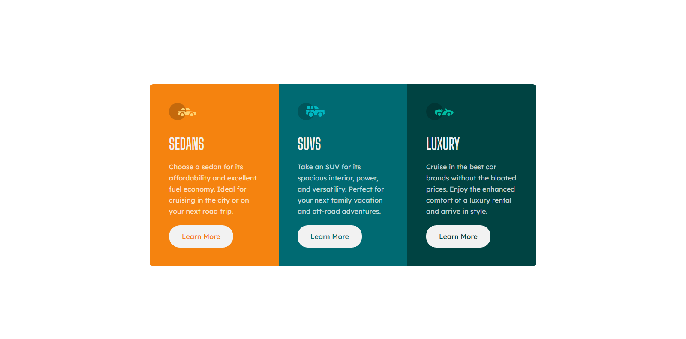

# Frontend Mentor - 3-column preview card component solution

This is a solution to the [3-column preview card component challenge on Frontend Mentor](https://www.frontendmentor.io/challenges/3column-preview-card-component-pH92eAR2-). Frontend Mentor challenges help you improve your coding skills by building realistic projects. 

## Table of contents

- [Overview](#overview)
  - [The challenge](#the-challenge)
  - [Screenshot](#screenshot)
  - [Links](#links)
- [My process](#my-process)
  - [Built with](#built-with)
  - [Useful resources](#useful-resources)
- [Author](#author)

## Overview

### The challenge

Users should be able to:

- View the optimal layout depending on their device's screen size
- See hover states for interactive elements

### Screenshot

### Links
- Live Site URL: [Live Site](https://devjhex-3-column-preview-card-component.vercel.app/)

## My process

### Built with

- Semantic HTML5 markup
- CSS custom properties
- Flexbox
- Mobile-first workflow

### Continued development

I'm so happy that my skills concerning CSS are growing so fast and I hope to skill up even more when it comes to writing meaningful CSS.

## Author

- Frontend Mentor - [@Dev-Jhex](https://www.frontendmentor.io/Dev-Jhex/yourusername)
- Twitter - [@devJhex](https://www.twitter.com/devJhex)
